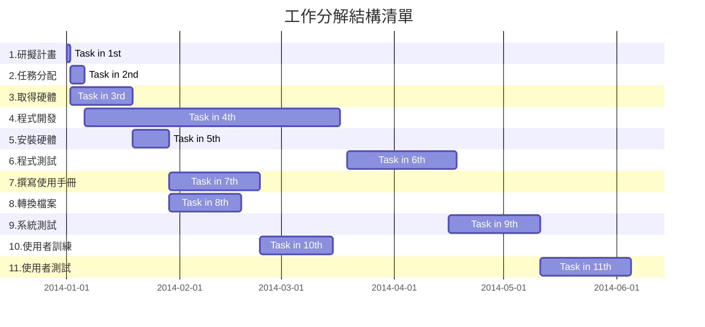
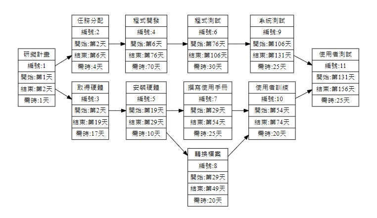

# 專案管理

## 甘特圖

```mermaid
gantt
    title 工作分解結構清單

    section 1.研擬計畫
    Task in 1st      :a1, 2014-01-01, 1d
    section 2.任務分配
    Task in 2nd      :2014-01-02  , 4d
    section 3.取得硬體
    Task in 3rd      :2014-01-02  , 17d
    section 4.程式開發
    Task in 4th      :2014-01-06  , 70d
    section 5.安裝硬體
    Task in 5th      :2014-01-19  , 10d
    section 6.程式測試
    Task in 6th      :2014-03-19  , 30d
    section 7.撰寫使用手冊
    Task in 7th      :2014-01-29  , 25d
    section 8.轉換檔案
    Task in 8th      :2014-01-29  , 20d
    section 9.系統測試
    Task in 9th      :2014-04-16  , 25d
    section 10.使用者訓練
    Task in 10th      :2014-02-23  , 20d
    section 11.使用者測試
    Task in 11th      :2014-05-11  , 25d
```

## PERT/CPM圖

## 關鍵路徑
```
1 -> 2 -> 4-> 6 -> 9 -> 11
